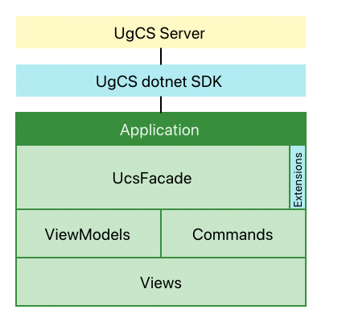

# Route Uploading Example

This application explains how to upload a route to a vehicle from the beginning or from a certain waypoint using UgCS dotnet sdk.

## Disclaimer
This app is for educational purposes only. We recomend to use it with UgCS emulators or [SITL Simulator](https://ardupilot.org/dev/docs/sitl-simulator-software-in-the-loop.html). We don't recomend to use it with real drones. However, if you decide to use it with a real drone, switch the drone to simulation mode.

## Prerequisites
- Visual Studio 2017;
- .Net runtime 4.6.2;
- UgCS 4.2 or newer with Professional or Enterprise license activated.

## How to run
1. Run UgCS Service Manager. 
2. Open `RouteUploading.sln` in Visual Studio and click Start (F5).
3. Whait until the app is connected to UgCS.
4. In the "Vehicle" combobox select a vehicle you are going to upload the route to. The selected vehicle will be displayed on the map.
5. Click *"Open route"* button. 
6. In the opened dialog select any route which is compatable with the selected vehicle and click *Ok*. The route will be displayed on the map.
7. (optional) Click on any waypoint if you want to start the route from a certain waypoint.
8. Click *"Upload route"* button. The route will be uploaded to the vehicle.
9. Click *ARM* button then click *AUTO*. The vehicle will executing the route.

**Note:** if you use UgCS Professional be sure that UgCS client is closed. Because with UgCS Professional only one client can connect to the UgCS Server at the same time.

## Code structure
The application is a classic WPF MVVM application.

- *UcsFacade* - provide simple API for executing requests and subscribe to events. Introduced to simplify source code.
- *Extensions* - a set of classes that extend UcsFacade to provide more specific operations such as uploading a route or executing vehicle commands.
- *ViewModels* - get data from UgCS Server through UcsFacade to display for the user.
- *Commands* - implement actions such as uploading a route to the vehicle.

The *App* class is a part of model. It contains the `ActiveRoute` and the `ActiveVehicle` properties. View models listen for changes in these properties and represent the corresponding state for views. As well view models and commands change these properties in response to the user actions.

For route uploading, the most important things to understand are how to upload the route and how to get a chain of route waypoints to upload a route from a certain waypoint. See *UploadCommand* class and *RoutingUtils.GetWaypoints* method to understand these things.

## Dependencies
- [Nito.CalculatedProperties](https://github.com/StephenCleary/CalculatedProperties) - simplifies the implementation of calculated properties. But be careful about is to only access these properties from the UI thread.
- [XAML.MapControl](https://github.com/ClemensFischer/XAML-Map-Control) - easy to use WPF-compatible map control.